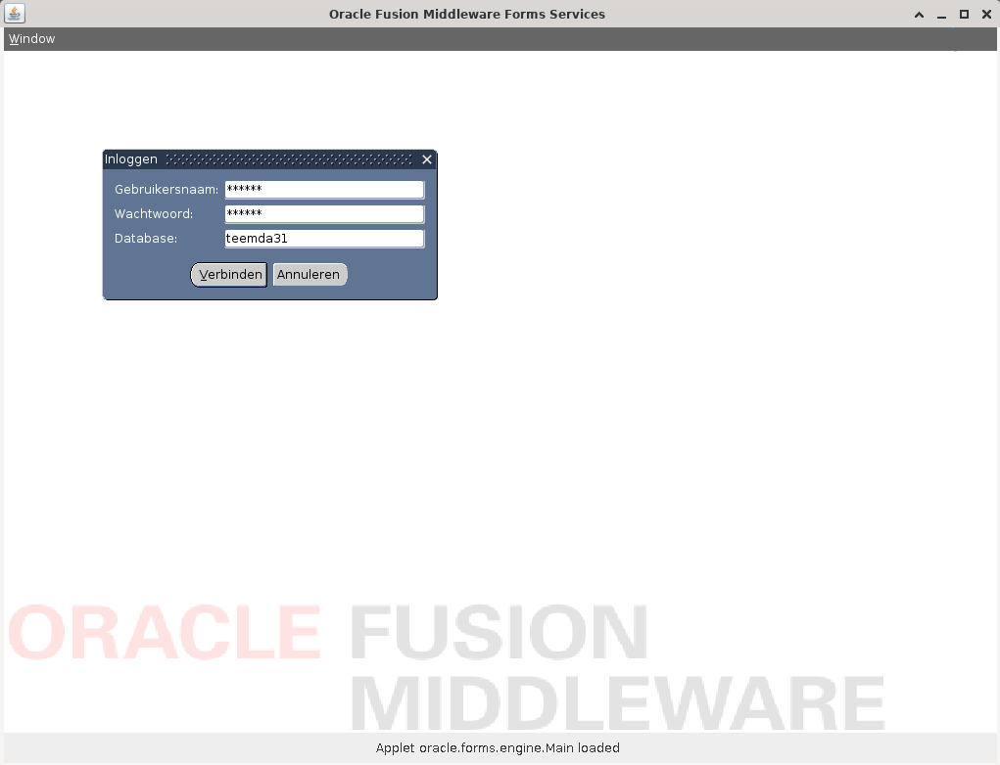

# Oracle Forms Standalone Runner

---

Warning: requirement - you need a __JAVA 8 JDK (or runtime)__ to (build and) start this thing!

Warning: I have found out that this launcher does NOT YET work with our LOAD-BALANCED production servers!
I can use it fine with all dev/tst/acc instances, as they are not using loadbalancers. I will definitely
look into fixing this issue (probably has to do with sticky session cookies which are not returned at the
moment).

---

See also the blog page about how I created this code: https://www.kaper.com/java/oracle-forms-standalone-runner/

At the office, we still use some old oracle-forms-11 applications. The "normal" users will run these from windows,
in the Edge browser switched to old Internet-Explorer compatibility mode...
You can not start Oracle Forms Applets in any other browser or operating system, as applets are no longer supported.

__As I do run a Linux machine, I do not have Edge, and needed something else to run the Oracle-Forms applications__.

__This standalone application will:__
- read the html page from the URL as passed in on the command line,
- find the last applet tag in there,
- and will try to start it.

It does read the parameters from the applet definition, and changes some of them to simulate
as if we were started from a browser on the given URL.
The code will also download the listed applet JAR files (in memory) to be able to start the applet.
You can override any of the applet start parameters if needed.

Created by Thijs Kaper, September 24, 2022.

p.s. This has been tested with success now on Linux, and on MacOS. See bottom of document for java versions
to use if your java 8 does not work.

---

This code is heavily based on the code from the next url (it is a tweak on the original to fill in some
blanks / "todos", and it adds reading of the html starter page, and I have done some code refactoring):

http://www.java2s.com/Code/Java/Swing-JFC/AppletViewerasimpleAppletViewerprogram.htm

See the AppletViewer class for the original copyright notice.

Original Author:  Ian Darwin, https://www.darwinsys.com/

---

## Download

To use this tool you do not have to build it yourself, just download the jar file from the target folder in this repository:

<a href="https://github.com/atkaper/oracle-forms-standalone-runner/raw/master/target/oracle-forms-runner-1.0.0-SNAPSHOT.jar">https://github.com/atkaper/oracle-forms-standalone-runner/raw/master/target/oracle-forms-runner-1.0.0-SNAPSHOT.jar</a>

Alternatively, if you want to build this yourself, you can clone this whole git project, and build it using maven / java-8:

```
mvn clean package
```

Result is the target/oracle-forms-runner-1.0.0-SNAPSHOT.jar executable.

## Run

You do need a local installation of java 8 (runtime or jdk). See bottom of this document for version references, not all versions seem to work.

Example start (replace the shown URL by your forms start url):

```
java -Doverride_separateFrame=false -jar oracle-forms-runner-1.0.0-SNAPSHOT.jar "http://eforms-tst3.ecom.somewhere.nl:8888/forms/frmservlet?config=emda"
```

I have multiple JDK/JVM versions on my machine, make sure you use java 8! I for example type this, instead of just "java", to make sure I use the java 8 version:

```
~/bin/java/jdk8/bin/java
```

Of course for you this will be different, depending on where you keep your java-8 program folder.

Addition (see also bottom of document) - for my big monitor, and non-fitting Linux fonts, I use the next start parameters:

```
java -Doverride_separateFrame=false -Doverride_mapFonts=yes -Doverride_clientDPI=120 -Doverride_downsizeFontPixels=3 -jar oracle-forms-runner-1.0.0-SNAPSHOT.jar "http://eforms-tst3.ecom.somewhere.nl:8888/forms/frmservlet?config=emda"
```

And if you have a normal monitor, and only want to scale down the font by 1 pixel, use this:

```
java -Doverride_separateFrame=false -Doverride_mapFonts=yes -Doverride_downsizeFontPixels=1 -jar oracle-forms-runner-1.0.0-SNAPSHOT.jar "http://eforms-tst3.ecom.somewhere.nl:8888/forms/frmservlet?config=emda"
```

## Applet Document/URL display

If you let the applet open a document URL, it will try to use your system browser. If that does not work, you can pass in the command line command
needed to open the proper browser as extra ```-Doverride_browser=...``` option. For example to use "firefox", try the next command line:

```
java -Doverride_browser=firefox -Doverride_separateFrame=false -jar oracle-forms-runner-1.0.0-SNAPSHOT.jar http://eforms-tst3.ecom.somewhere.nl:8888/forms/frmservlet?config=emda
```

## Override Start Parameters

Already shown in above two start examples; you can pass in any parameter override by using java -D options:
```-Doverride_KEY=VALUE```. Just replace "KEY" by the property name, and "VALUE" by the required override value.
You can specify as many of these as you need.

On startup, you will see all parsed parameters, and you will also see your defined overrides.

## Disclaimers

- I have no clue if this code works for ALL oracle forms functions, so if something does not work, let me know.
For us, the one screen I wanted to use seems to work fine, and some others also display fine. So just give it a try... ;-)
- I run this in Linux, and do see that possibly my system has some different font-sizes than the Windows browser version will have. So some texts might not align perfectly.
- I have no knowledge about programming / developing IN oracle forms, so do not bother to aks me about that. I only got this webstart applet to run standalone.

Addition: the disclaimer about font-sizes can now be fixed by tweaking some startup parameters. See bottom of document.

## Demo Run

Screenshots:




Command line command / log info:

```
[:thijs@fizzgig Downloads] $ ~/bin/java/jdk8/bin/java -Doverride_separateFrame=false -jar oracle-forms-runner-1.0.0-SNAPSHOT.jar "http://eforms-tst3.ecom.somewhere.nl:8888/forms/frmservlet?config=emda"

Sat Sep 24 17:37:53 CEST 2022: ---
Sat Sep 24 17:37:53 CEST 2022: Oracle Forms - Standalone Applet Runner - created by Thijs Kaper - 24 Sept, 2022
Sat Sep 24 17:37:53 CEST 2022: ---
Sat Sep 24 17:37:53 CEST 2022: Java Version: 1.8.0_281
Sat Sep 24 17:37:53 CEST 2022: ---
Sat Sep 24 17:37:53 CEST 2022: Start Url: http://eforms-tst3.ecom.somewhere.nl:8888/forms/frmservlet?config=emda
Sat Sep 24 17:37:53 CEST 2022: Base Url:http://eforms-tst3.ecom.somewhere.nl:8888
Sat Sep 24 17:37:53 CEST 2022: ---
Sat Sep 24 17:37:53 CEST 2022: PLUGINSPAGE = https://java.com/en/download/index.jsp
Sat Sep 24 17:37:53 CEST 2022: TYPE = application/x-java-applet
Sat Sep 24 17:37:53 CEST 2022: java_codebase = http://eforms-tst3.ecom.somewhere.nl:8888/forms/java
Sat Sep 24 17:37:53 CEST 2022: java_code = oracle.forms.engine.Main
Sat Sep 24 17:37:53 CEST 2022: java_archive = hstall.jar,frmall.jar,jacob.jar,frmwebutil.jar
Sat Sep 24 17:37:53 CEST 2022: WIDTH = 1024
Sat Sep 24 17:37:53 CEST 2022: HEIGHT = 786
Sat Sep 24 17:37:53 CEST 2022: HSPACE = 0
Sat Sep 24 17:37:53 CEST 2022: VSPACE = 0
Sat Sep 24 17:37:53 CEST 2022: NAME = forms_applet
Sat Sep 24 17:37:53 CEST 2022: serverURL = http://eforms-tst3.ecom.somewhere.nl:8888/forms/lservlet?ifcfs=/forms/frmservlet?config=emda&ifsessid=WLS_FORMS.formsapp.278&acceptLanguage=null
Sat Sep 24 17:37:53 CEST 2022: networkRetries = 0
Sat Sep 24 17:37:53 CEST 2022: serverArgs = escapeParams=true module=emdaui000f.fmx userid=  debug=no host= port= obr=no record= tracegroup= log= term=/appl/tst/ise/oras/tecom001/tfrms001/config/FormsComponent/forms/server/XXXXX_fmrpcweb.res ssoProxyConnect=no
Sat Sep 24 17:37:53 CEST 2022: separateFrame = true
Sat Sep 24 17:37:53 CEST 2022: splashScreen = no
Sat Sep 24 17:37:53 CEST 2022: lookAndFeel = Oracle
Sat Sep 24 17:37:53 CEST 2022: colorScheme = blue
Sat Sep 24 17:37:53 CEST 2022: logo = logo.gif
Sat Sep 24 17:37:53 CEST 2022: imageBase = codebase
Sat Sep 24 17:37:53 CEST 2022: EndUserMonitoringEnabled = false
Sat Sep 24 17:37:53 CEST 2022: allowAlertClipboard = true
Sat Sep 24 17:37:53 CEST 2022: disableValidateClipboard = false
Sat Sep 24 17:37:53 CEST 2022: enableJavascriptEvent = true
Sat Sep 24 17:37:53 CEST 2022: MAYSCRIPT = true
Sat Sep 24 17:37:53 CEST 2022: digitSubstitution = context
Sat Sep 24 17:37:53 CEST 2022: legacy_lifecycle = false
Sat Sep 24 17:37:53 CEST 2022: JavaScriptBlocksHeartBeat = false
Sat Sep 24 17:37:53 CEST 2022: highContrast = false
Sat Sep 24 17:37:53 CEST 2022: guiMode = 0
Sat Sep 24 17:37:53 CEST 2022: WebUtilLogging = off
Sat Sep 24 17:37:53 CEST 2022: WebUtilLoggingDetail = normal
Sat Sep 24 17:37:53 CEST 2022: WebUtilErrormode = Alert
Sat Sep 24 17:37:53 CEST 2022: WebUtilDispatchMonitorInterval = 5
Sat Sep 24 17:37:53 CEST 2022: WebUtilTrustInternal = true
Sat Sep 24 17:37:53 CEST 2022: WebUtilMaxTransferSize = 16384
Sat Sep 24 17:37:53 CEST 2022: applet_stop_timeout = 800
Sat Sep 24 17:37:53 CEST 2022: java_documentbase = http://eforms-tst3.ecom.somewhere.nl:8888/forms/frmservlet?config=emda
Sat Sep 24 17:37:53 CEST 2022: > Property Override: separateFrame = false
Sat Sep 24 17:37:53 CEST 2022: ---
Sat Sep 24 17:37:53 CEST 2022: Download/Activate jar: http://eforms-tst3.ecom.somewhere.nl:8888/forms/java/hstall.jar
Sat Sep 24 17:37:53 CEST 2022: Download/Activate jar: http://eforms-tst3.ecom.somewhere.nl:8888/forms/java/frmall.jar
Sat Sep 24 17:37:53 CEST 2022: Download/Activate jar: http://eforms-tst3.ecom.somewhere.nl:8888/forms/java/jacob.jar
Sat Sep 24 17:37:53 CEST 2022: Download/Activate jar: http://eforms-tst3.ecom.somewhere.nl:8888/forms/java/frmwebutil.jar
Sat Sep 24 17:37:53 CEST 2022: ---
Sat Sep 24 17:37:53 CEST 2022: Status: AppletAdapter constructed
Sat Sep 24 17:37:53 CEST 2022: Status: Loading Applet oracle.forms.engine.Main
Sat Sep 24 17:37:56 CEST 2022: Status: Applet oracle.forms.engine.Main loaded
Forms Session ID is WLS_FORMS.formsapp.278
The proxy host is null, and the proxy port is 0.
Native HTTP implementation is being used for the connection.
The connection mode is HTTP.
Forms Applet version is 11.1.2.2
Sat Sep 24 17:40:55 CEST 2022: ### EXIT ###

[:thijs@fizzgig Downloads] $ 
```


## Example HTML launch page

Here an example content of the HTML page ("http://eforms-tst3.ecom.somewhere.nl:8888/forms/frmservlet?config=emda") to start the Oracle Forms app
for which this is created (some company specific values have been overwritten).
This is just an example, so you know what the code is trying to parse. The code searched for the last "<embed...>" tag in the page, and reads all
properties from it (key="value" pairs).

```html
<HTML>
<!-- FILE: webutiljpi.htm (Oracle Forms)                            -->
<!--                                                                -->
<!-- This is the default base HTML file for running a form on the   -->
<!-- web using the JDK Java Plugin. And includes a certificate      --> 
<!-- registration applet for the WebUtil utility                    -->
<!--                                                                -->
<!-- IMPORTANT NOTES:                                               -->
<!-- Default values for all the variables which appear below        -->
<!-- (enclosed in percent characters) are defined in the servlet    -->
<!-- configuration file (formsweb.cfg). It is preferable to make    -->
<!-- changes in that file where possible, rather than this one.     -->
<!--                                                                -->
<!-- This file uses several extra tags that are not present in the  -->
<!-- default template files.  You should ensure that these are      -->
<!-- present in the configuration that uses this template           -->
<!-- The extra substitution Tags are:                               -->
<!--  jacob.jar,frmwebutil.jar = jar file containing the WebUtil code       -->
<!--                     (by default this should be frmwebutil.jar) -->
<!--  off = Defines the current logging mode.          -->
<!--                     Valid values: off|on|console|server|all    -->
<!--                     (on == console)                            -->
<!--  normal = Specifies the level of error logging.-->
<!--                     Valid values: normal|detailed              -->
<!--  Alert = Should errors be displayed in an alert   -->
<!--                     as well as the programmer defined          -->
<!--                     locations                                  -->
<!--                     Valid values: console|server|alert|all     -->
<!--  5 = Counts in second to        -->
<!--                     indicate how often the monitor thread      -->
<!--                     checks to see if the Forms session is still-->
<!--                     alive. Used with the WebUtil_Session       -->
<!--                     package.                                   -->
<!--  true = Should intranet without domain suffix-->
<!--                     be trusted.                                -->
<!--                     Valid values: true|yes|false|no            -->
<!--  16384 = Size in bytes of file transfer     -->
<!--                     segments. Default and maximum allowed is   -->
<!--                     16384, i.e. 16K.                           -->
<HEAD><TITLE>E-Commerce Oracle Fusion Middleware Forms Services - WebUtil</TITLE></HEAD>
<BODY >

<!-- Registration applet definition (start) -->
<OBJECT classid="clsid:CAFEEFAC-0016-0000-FFFF-ABCDEFFEDCBA"
        codebase="https://java.sun.com/update/1.6.0/jinstall-6u17-windows-i586.cab"
        WIDTH="0"
        HEIGHT="0"
        HSPACE="0"
        VSPACE="0">
<PARAM NAME="TYPE"       VALUE="application/x-java-applet">
<PARAM NAME="CODEBASE"   VALUE="/forms/java">
<PARAM NAME="CODE"       VALUE="oracle.forms.webutil.common.RegisterWebUtil" >
<PARAM NAME="ARCHIVE"    VALUE="jacob.jar,frmwebutil.jar" >
<COMMENT>
<EMBED SRC="" PLUGINSPAGE="https://java.com/en/download/index.jsp"
        TYPE="application/x-java-applet"
        java_codebase="/forms/java"
        java_code="oracle.forms.webutil.common.RegisterWebUtil"
        java_archive="jacob.jar,frmwebutil.jar"
        WIDTH="1"
        HEIGHT="1"
        HSPACE="0"
        VSPACE="0"
>
<NOEMBED>
</COMMENT>
</NOEMBED></EMBED>
</OBJECT>
<!-- Registration applet definition (end) -->
<COMMENT id="forms_plugin_info" 
         serverURL="/forms/lservlet?ifcfs=/forms/frmservlet?config=emda&#38;ifsessid=WLS_FORMS.formsapp.277&#38;acceptLanguage=en,nl;q=0.7,en-US;q=0.3"
         plug_ver="clsid:CAFEEFAC-0016-0000-FFFF-ABCDEFFEDCBA" 
         appheight="786"
         appwidth="1024"
         appcodebase="https://java.sun.com/update/1.6.0/jinstall-6u17-windows-i586.cab"
         appname="forms_applet">
</COMMENT>
<P><BR>
Please wait while the Forms Client class files download and run. <BR>
This will take a second or two...</P>
<!-- Forms applet definition (start) -->
<NOSCRIPT>
<OBJECT classid="clsid:CAFEEFAC-0016-0000-FFFF-ABCDEFFEDCBA"
        codebase="https://java.sun.com/update/1.6.0/jinstall-6u17-windows-i586.cab"
        WIDTH="1024"
        HEIGHT="786"
        HSPACE="0"
        VSPACE="0"
        ID="forms_applet">
</NOSCRIPT>
<SCRIPT LANGUAGE="JavaScript" SRC="/forms/frmjscript/forms_ie.js"></SCRIPT> 
<PARAM NAME="TYPE"       VALUE="application/x-java-applet">
<PARAM NAME="CODEBASE"   VALUE="/forms/java">
<PARAM NAME="CODE"       VALUE="oracle.forms.engine.Main" >
<PARAM NAME="ARCHIVE"    VALUE="hstall.jar,frmall.jar,jacob.jar,frmwebutil.jar" >
<PARAM NAME="serverURL" VALUE="/forms/lservlet?ifcfs=/forms/frmservlet?config=emda&#38;ifsessid=WLS_FORMS.formsapp.277&#38;acceptLanguage=en,nl;q=0.7,en-US;q=0.3">
<PARAM NAME="networkRetries" VALUE="0">
<PARAM NAME="serverArgs"
       VALUE="escapeParams=true module=emdaui000f.fmx userid=  debug=no host= port= obr=no record= tracegroup= log= term=/appl/tst/ise/oras/tecom001/tfrms001/config/FormsComponent/forms/server/XXXXX_fmrpcweb.res ssoProxyConnect=no">
<PARAM NAME="separateFrame" VALUE="true">
<PARAM NAME="splashScreen"  VALUE="no">
<PARAM NAME="background"  VALUE="">
<PARAM NAME="lookAndFeel"  VALUE="Oracle">
<PARAM NAME="colorScheme"  VALUE="blue">
<PARAM NAME="serverApp" VALUE="">
<PARAM NAME="logo" VALUE="logo.gif">
<PARAM NAME="imageBase" VALUE="codebase">
<PARAM NAME="formsMessageListener" VALUE="">
<PARAM NAME="recordFileName" VALUE="">
<PARAM NAME="EndUserMonitoringEnabled" VALUE="false">
<PARAM NAME="EndUserMonitoringURL" VALUE="">
<PARAM NAME="heartBeat" VALUE="">
<PARAM NAME="MaxEventWait" VALUE="">
<PARAM NAME="allowAlertClipboard" VALUE="true">
<PARAM NAME="disableValidateClipboard" VALUE="false">
<PARAM NAME="enableJavascriptEvent" VALUE="true">
<PARAM NAME="MAYSCRIPT" VALUE="true">
<PARAM NAME="digitSubstitution" VALUE="context">
<PARAM NAME="legacy_lifecycle" VALUE="false">
<PARAM NAME="JavaScriptBlocksHeartBeat" VALUE="false">
<PARAM NAME="highContrast" VALUE="false">
<PARAM NAME="disableMDIScrollbars" VALUE="">
<PARAM NAME="clientDPI" VALUE="">
<PARAM NAME="guiMode" VALUE="0">
<!-- Params specific to webutil -->
<PARAM NAME="WebUtilLogging" VALUE="off">
<PARAM NAME="WebUtilLoggingDetail" VALUE="normal">
<PARAM NAME="WebUtilErrorMode" VALUE="Alert">
<PARAM NAME="WebUtilDispatchMonitorInterval" VALUE="5">
<PARAM NAME="WebUtilTrustInternal" VALUE="true">
<PARAM NAME="WebUtilMaxTransferSize" VALUE="16384">
<PARAM name="applet_stop_timeout" value="800">
<COMMENT>
<EMBED  SRC="" PLUGINSPAGE="https://java.com/en/download/index.jsp"
        TYPE="application/x-java-applet"
        java_codebase="/forms/java"
        java_code="oracle.forms.engine.Main"
        java_archive="hstall.jar,frmall.jar,jacob.jar,frmwebutil.jar"
        WIDTH="1024"
        HEIGHT="786"
        HSPACE="0"
        VSPACE="0"
        NAME="forms_applet"
        serverURL="/forms/lservlet?ifcfs=/forms/frmservlet?config=emda&#38;ifsessid=WLS_FORMS.formsapp.277&#38;acceptLanguage=en,nl;q=0.7,en-US;q=0.3"
        networkRetries="0"
        serverArgs="escapeParams=true module=emdaui000f.fmx userid=  debug=no host= port= obr=no record= tracegroup= log= term=/appl/tst/ise/oras/tecom001/tfrms001/config/FormsComponent/forms/server/XXXXX_fmrpcweb.res ssoProxyConnect=no"
        separateFrame="true"
        splashScreen="no"
        background=""
        lookAndFeel="Oracle"
        colorScheme="blue"
        serverApp=""
        logo="logo.gif"
        imageBase="codebase"
        recordFileName=""
        EndUserMonitoringEnabled="false"
        EndUserMonitoringURL=""
        heartBeat=""
        MaxEventWait=""
        allowAlertClipboard="true"
        disableValidateClipboard="false"
        enableJavascriptEvent="true"
        MAYSCRIPT="true"
        digitSubstitution="context"
        legacy_lifecycle="false"
        JavaScriptBlocksHeartBeat="false"
        highContrast="false"
        disableMDIScrollbars=""
        clientDPI=""
        guiMode="0"
        WebUtilLogging="off"
        WebUtilLoggingDetail="normal"
        WebUtilErrormode="Alert"
        WebUtilDispatchMonitorInterval="5"
        WebUtilTrustInternal="true"
        WebUtilMaxTransferSize="16384"
        applet_stop_timeout="800"
>
<NOEMBED>
</COMMENT>
</NOEMBED></EMBED>
</OBJECT>
<!-- Forms applet definition (end) -->

</BODY>
</HTML>
```

## Java Runtime Version Reference

I am running this on Linux Mint (20.3 Una, at the moment kernel 5.17.0-rc8+).
The JVM version I use is this one:

```
java version "1.8.0_281"
Java(TM) SE Runtime Environment (build 1.8.0_281-b09)
Java HotSpot(TM) 64-Bit Server VM (build 25.281-b09, mixed mode)
```

Which does not really tell what brand java it is ;-) But it is the __Oracle__ one (Sorry for that, we have swicthed most of our stuff to non-oracle, due to license dangers). I did not try any other "brands" for java 8 yet on Linux for this.

A colleague of mine has tested runnig this on MacOS (thanks Stuart!), and found out that not all java 8 runtimes do work.

This one DOES work on MacOS:

https://newreleases.io/project/github/corretto/corretto-8/release/8.302.08.1

```
openjdk version "1.8.0_302"
OpenJDK Runtime Environment Corretto-8.302.08.1 (build 1.8.0_302-b08)
OpenJDK 64-Bit Server VM Corretto-8.302.08.1 (build 25.302-b08, mixed mode)
```

And these two DID NOT work:

```
openjdk version "1.8.0_345"
OpenJDK Runtime Environment (Temurin)(build 1.8.0_345-b01)
OpenJDK 64-Bit Server VM (Temurin)(build 25.345-b01, mixed mode)

openjdk version "1.8.0_345"
OpenJDK Runtime Environment (Zulu 8.64.0.19-CA-macosx) (build 1.8.0_345-b01)
OpenJDK 64-Bit Server VM (Zulu 8.64.0.19-CA-macosx) (build 25.345-b01, mixed mode)
```

These last two ended up ging a startup exception, indicating a missing runtime class:

```
Exception in thread "main" java.lang.NoClassDefFoundError: netscape/javascript/JSException
    at java.lang.Class.forName0(Native Method)
    at java.lang.Class.forName(Class.java:264)
    at com.kaper.forms.AppletViewer.loadApplet(AppletViewer.java:155)
    at com.kaper.forms.AppletViewer.<init>(AppletViewer.java:123)
    at com.kaper.forms.OracleFormsRunner.main(OracleFormsRunner.java:96)
Caused by: java.lang.ClassNotFoundException: netscape.javascript.JSException
    at java.net.URLClassLoader.findClass(URLClassLoader.java:387)
    at java.lang.ClassLoader.loadClass(ClassLoader.java:419)
    at sun.misc.Launcher$AppClassLoader.loadClass(Launcher.java:352)
    at java.lang.ClassLoader.loadClass(ClassLoader.java:352)
    ... 5 more
```

If anyone has any additions to the list of (java 8) versions which WILL or WILL-NOT work, let me know, and I'll add them here.

## Font Issues

Attempts at adding the proper fonts to use (on Linux Mint):

```
sudo apt-get install ttf-mscorefonts-installer
```

Also tried installing this one: https://www.wfonts.com/font/dialog, as I did see in debug that this is one
of the font names in use.

This did not help... my fonts do not yet fit perfectly on screen.

To get this fixed, I did some debugging on a running Oracle Forms App, decompiled some of their code,
and found that Oracle Forms does have some system implemented to re-scale fonts. This however only
works on SunOS, and some old Windows flavours. To make this work on my Linux system, I have implemented
two classes to fix this. See FontMapping and FontTable. To activate the font scaling, you can add two
startup override parameters:

Example, just making the font 1 pixel smaller:

```
-Doverride_mapFonts=yes -Doverride_downsizeFontPixels=1
```

I also did find out that there is a parameter to override the auto-detecting of your screen resolution (DPI).
My screen is 2560x1440 pixels, with DPI 96. This gives me a quite small Forms screen. To make it a bit bigger,
I can start my Forms using the following options:

Suitable for 2560x1440 monitor on Linux:

```
-Doverride_separateFrame=false -Doverride_mapFonts=yes -Doverride_clientDPI=120 -Doverride_downsizeFontPixels=3
```

You can play around with the ```clientDPI``` and ```downsizeFontPixels``` values until the screen looks OK to you.
Note: during startup, the tool wil log a line like this: ```Screen Resolution: 96``` to show the
default screen DPI. This will give you some idea of how to tweak it to a suitable value.

Here's a partial screenshot of the new screen and font sizes on my machine. If you compare this to the screenshots above,
this does fit much better!


Note: if you downloaded the tool jar before, you will need to re-download it now to make use of the font fixes.
I did not update the version nr in the jar, so the name is still the same.

Warning: the new setting ```downsizeFontPixels``` will probably NOT work on Windows.
